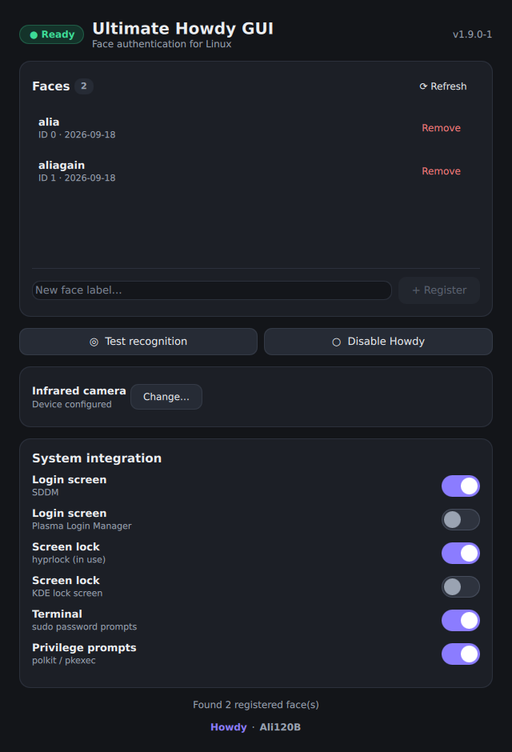

# Ultimate Howdy GUI

A Qt-based graphical interface for managing [**Howdy**](https://github.com/boltgolt/howdy) face authentication on Linux systems with Windows Hello compatible hardware.

Created and maintained by **[Ali120B](https://github.com/Ali120B)** — contact: alibashmail2010@yahoo.com



## Hardware Requirements

- **IR Camera**: A Windows Hello compatible infrared camera is required. Found in:
  - Modern laptops (Dell, Lenovo ThinkPad, HP EliteBook, Microsoft Surface, etc.)
  - External webcams (e.g., Logitech Brio)

- **Supported Devices**: Your IR camera must be recognized by Linux and accessible via `/dev/video*`

## Testing The App

This application works on any Arch-based distribution (XeroLinux, CachyOS, EndeavourOS, plain Arch, ...).
It auto-detects the installed Howdy flavour (`pam_howdy.so` vs `pam_python.so`) and display manager
(`sddm` vs `plasmalogin`).

To test without installing the package:

```bash
# Install dependencies (CachyOS / Arch)
sudo pacman -S rust clang qt6-base qt6-declarative qt6-multimedia howdy v4l-utils mpv polkit

# Optional: for actual login/sudo/polkit face auth you also need pam-python (AUR),
# otherwise Howdy CLI (enroll/test) works but the PAM module is missing:
yay -S pam-python

# Clone and run
git clone https://github.com/Ali120B/ultimate-howdy-gui.git
cd ultimate-howdy-gui
cargo run
```

## Notes for CachyOS / Arch users

- **IR camera**: if your laptop exposes RGB on `/dev/video0` and IR on `/dev/video2`
  (check with `v4l2-ctl -d /dev/video2 --list-formats-ext` — IR sensors often show a
  small square frame like `340x340`), prefer the stable by-path device so the number
  can't shift between reboots, e.g.:
  `device_path = /dev/v4l/by-path/pci-0000:00:14.0-usb-0:5:1.2-video-index0`
  (`readlink -f` should resolve it to `/dev/video2`). The GUI's camera picker writes
  this for you via "Save & Continue".
- **Broken perms**: if `howdy` fails with `Permission denied` / `which howdy` finds
  nothing even though the package is installed, your `/usr/lib/security/howdy`
  tree probably has root-only modes (`drw-------`). Fix with:
  `sudo chmod 755 <dirs> && sudo chmod 644 <files> && sudo chmod 755 /usr/bin/howdy`'s
  target `cli.py` (see `fix-howdy-perms` snippet below).
- **PAM module**: stock `howdy` 2.6.x on Arch has neither `pam_howdy.so` nor
  `pam_python.so`. Install `pam-python` from the AUR before enabling Howdy in any
  PAM file, otherwise logins will fail over to password (or worse). This GUI inserts
  the correct `pam_python.so /lib/security/howdy/pam.py` line automatically.

## Usage

1. **Launch the application** - It will automatically detect if compatible hardware is present
   - Green banner: IR camera detected and ready
   - Red banner: No compatible camera found

2. **Register a face**:
   - Enter a name in the text field (e.g., "Default", "Glasses", "Low Light")
   - Click "Register Face"
   - Look at your IR camera when prompted
   - Authenticate with your password via polkit

3. **Test recognition**:
   - Click "Test Recognition" to verify your face is being detected properly

4. **Manage faces**:
   - View all registered faces in the list
   - Click "Remove" to delete a specific face model
   - Use "Refresh" to reload the list

5. **Enable/Disable**:
   - Toggle Howdy on or off system-wide using the Enable/Disable button
